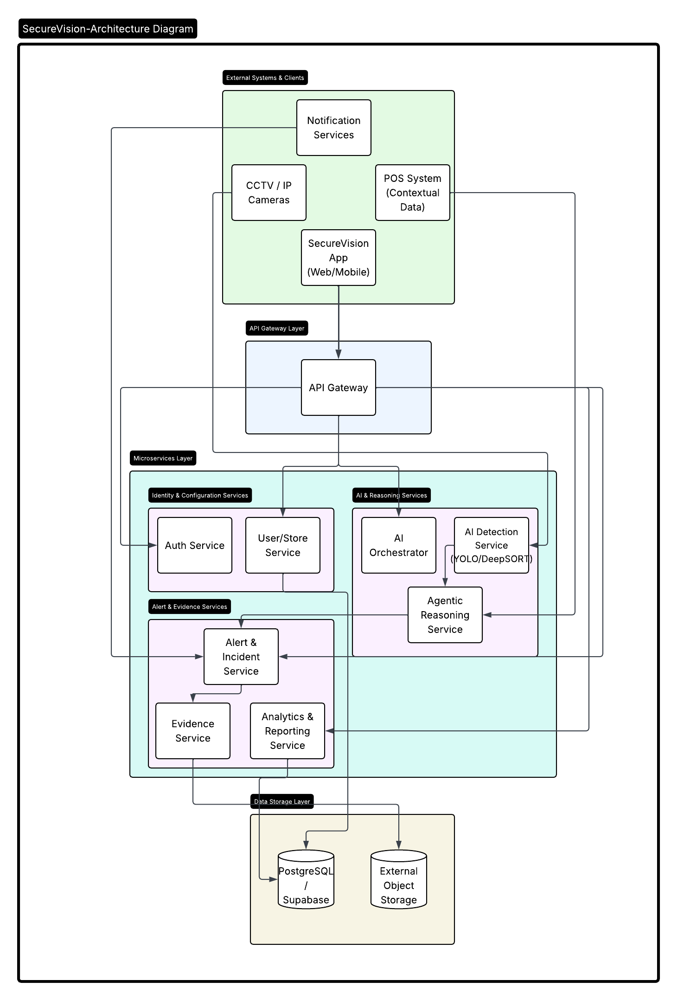

<div align="center">

# 🛡️ SecureVision

### ⚡ Real-Time AI Surveillance System Powered by Computer Vision

</div>

<p align="center">
  <a href="https://secure-vision-phi.vercel.app/">
    🚀 Live Demo
  </a>
</p>

---

<p align="center">
  
</p>

---

<p align="center">
  
  
  
  
</p>

---

## 🎯 What is SecureVision?

SecureVision is a **real-time AI surveillance system** that transforms traditional CCTV into an **intelligent monitoring system**.

Instead of passively recording video, it:

> 🧠 Understands live video streams  
> ⚡ Detects events in real-time  
> 🚨 Enables proactive monitoring  

---

## 🎥 Live System Preview

<p align="center">
  
</p>

> ⚠️ Add a screen recording here — this is the MOST important part for recruiters.

---

## 🧠 System Architecture

<p align="center">
  
</p>

```text
Camera Feed → Frame Extraction → YOLO Detection → Event Processing → UI Dashboard

## ⚙️ Core Features

- ⚡ Real-time multi-frame processing  
- 🎯 YOLO-based object detection  
- 📡 Streaming inference pipeline  
- 🧠 Event-based activity recognition  
- 🖥️ Interactive monitoring UI  
- 📊 Low-latency optimized architecture  

---

## 🚨 Problem

Traditional CCTV systems:

- ❌ Only record footage  
- ❌ Require constant human monitoring  
- ❌ Miss critical real-time events  

---

## 💡 Solution

SecureVision converts passive surveillance into active AI monitoring:

- 🔍 Detects objects in real time  
- 📡 Processes live streams continuously  
- 🚨 Generates actionable insights instantly  

---

## 🛠️ Tech Stack

| Layer | Technology |
|------|------------|
| Computer Vision | YOLO, OpenCV |
| AI Pipeline | Real-time inference system |
| Frontend | React / TypeScript |
| Backend | Python (or Node.js) |
| Deployment | Vercel |

---

## 📊 Performance

| Metric | Value |
|--------|------|
| Detection Accuracy | ~77% |
| Latency | Real-time optimized |
| Streams Supported | Multi-feed pipeline |

---

## 🧩 Engineering Challenges

- Maintaining real-time inference under continuous streams  
- Optimizing YOLO for low latency  
- Designing scalable multi-camera architecture  

---

## 🔮 Future Improvements

- Multi-camera synchronization system  
- Edge deployment (Jetson / Raspberry Pi)  
- Behavior recognition (temporal models)  
- Smart alert system (SMS / Email / Push notifications)  

---

## 🧠 Why This Project Matters

This project demonstrates:

- Real-world AI system design  
- Computer vision + backend integration  
- Production-style deployment thinking  
- Scalable ML pipeline engineering  

---

## 👨‍💻 Author

**Miral Hasan**

<p align="center">
  <a href="https://github.com/miralhsn">GitHub</a> •
  <a href="https://linkedin.com/in/miral-hasan-26353b249">LinkedIn</a>
</p>

<p align="center">
  ⭐ If you like this project, give it a star!
</p>


